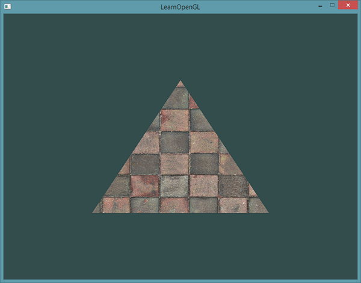

# Learn OpenGL 笔记

## CH1 入门

### 渲染管线

OpenGL的大部分工作都是关于把3D坐标转变为适应你屏幕的2D像素。3D坐标转为2D坐标的处理过程是由OpenGL的图形渲染管线管理。

- 3D 坐标转换为 2D。
- 2D 坐标转换为实际有颜色的像素。

图形渲染管线可以被划分为几个阶段，每个阶段将会把前一个阶段的输出作为输入。

> **顶点着色器** -> **图元装配** -> **光栅化** -> **片段着色器** -> **测试与混合**

### 着色器

显卡都有成千上万的小处理核心，它们在GPU上为每一个（渲染管线）阶段运行各自的小程序，从而在图形渲染管线中快速处理你的数据。这些小程序叫做**着色器(Shader)**。

着色器编程：着色器可以由开发者配置，因为允许用自己写的着色器来代替默认的，所以能够更细致地控制图形渲染管线中的特定部分了。

OpenGL着色器是用OpenGL着色器语言(OpenGL Shading Language, **GLSL**)写成的。

我们打算做渲染的话，现代OpenGL需要我们至少设置一个顶点和一个片段着色器。

### 标准化设备坐标(Normalized Device Coordinates, NDC)

一旦你的顶点坐标已经在顶点着色器中处理过，它们就应该是标准化设备坐标了，标准化设备坐标是一个**x、y和z值在-1.0到1.0**的一小段空间。任何落在范围外的坐标都会被丢弃/裁剪，不会显示在你的屏幕上。

OpenGL不是简单地把所有的3D坐标变换为屏幕上的2D像素；OpenGL仅当3D坐标在3个轴（x、y和z）上-1.0到1.0的范围内时才处理它。所有在这个范围内的坐标叫做标准化设备坐标(Normalized Device Coordinates，NDC)，此范围内的坐标最终显示在屏幕上（在这个范围以外的坐标则不会显示）。

### glViewport

### 顶点缓冲对象（VBO）

定义顶点数据以后，会把它作为输入发送给图形渲染管线的第一个处理阶段：顶点着色器。它会在GPU上创建 **内存**用于储存我们的顶点数据，还要配置OpenGL如何解释这些内存，并且指定其如何发送给显卡。通过**顶点缓冲对象(Vertex Buffer Objects, VBO)**管理这个内存，它会在GPU内存（通常被称为显存）中储存大量顶点。

### 顶点数组对象（VAO）

每个物体的绘制需要与绑定不同的顶点缓冲对象，所以 opengl 再绘制时，需要不断的切换 VBO，设置顶点属性指针，设置顶点数据，非常麻烦。

所以引入顶点数组对象，可以像顶点缓冲对象那样被绑定，任何随后的顶点属性调用都会储存在这个VAO中。这样的好处就是，当配置顶点属性指针时，你只需要将那些调用执行一次，之后再绘制物体的时候只需要绑定相应的VAO就行了。

要想使用VAO，要做的只是使用glBindVertexArray绑定VAO。从绑定之后起，我们应该绑定和配置对应的VBO和属性指针，之后解绑VAO供之后使用。当我们打算绘制一个物体的时候，我们只要在绘制物体前简单地把VAO绑定到希望使用的设定上就行了。这段代码应该看起来像这样：

### 元素缓冲对象（索引缓冲对象）(EBO/IBO)

减少重复顶点的内存消耗。存储 OpenGL 用来决定要绘制哪些顶点的索引。这种所谓的索引绘制(Indexed Drawing)正是我们问题的解决方案。

### 纹理

为了能够把纹理映射(Map)到三角形上，我们需要指定三角形的每个顶点各自对应纹理的哪个部分。这样每个顶点就会关联着一个纹理坐标(Texture Coordinate)，纹理坐标在x和y轴上，范围为0到1之间（注意我们使用的是2D纹理图像）。使用纹理坐标获取纹理颜色叫做**采样**。

1) 纹理环绕方式：

- GL_REPEAT: 对纹理的默认行为。重复纹理图像。
- GL_MIRRORED_REPEAT: 和GL_REPEAT一样，但每次重复图片是镜像放置的。
- GL_CLAMP_TO_EDGE: 纹理坐标会被约束在0到1之间，超出的部分会重复纹理坐标的边缘，产生一种边缘被拉伸的效果。
- GL_CLAMP_TO_BORDER: 超出的坐标为用户指定的边缘颜色。

2) 纹理过滤：

- GL_NEAREST：邻近过滤，opengl 的默认行为，OpenGL会选择中心点最接近纹理坐标的那个像素。
- GL_LINEAR： 线性过滤，基于纹理坐标附近的纹理像素，计算出一个插值，近似出这些纹理像素之间的颜色。

3) 多级渐远纹理（Mipmap）：

对于就离很远的物体使用高分辨率纹理，比较浪费内存。 mipmap 简单来说就是一系列的纹理图像，后一个纹理图像是前一个的二分之一。多级渐远纹理背后的理念很简单：距观察者的距离超过一定的阈值，OpenGL会使用不同的多级渐远纹理，即最适合物体的距离的那个。幸运的是 opengl 可以通过 glGenerateMipmap 函数，自动实现 mipmap 功能。

切换多级渐远纹理级别时你也可以在两个不同多级渐远纹理级别之间使用NEAREST和LINEAR过滤。为了指定不同多级渐远纹理级别之间的过滤方式，你可以使用下面四个选项中的一个代替原有的过滤方式：

- GL_NEAREST_MIPMAP_NEAREST: 使用最邻近的多级渐远纹理来匹配像素大小，并使用邻近插值进行纹理采样
- GL_LINEAR_MIPMAP_NEAREST: 使用最邻近的多级渐远纹理级别，并使用线性插值进行采样
- GL_NEAREST_MIPMAP_LINEAR: 在两个最匹配像素大小的多级渐远纹理之间进行线性插值，使用邻近插值进行采样
- GL_LINEAR_MIPMAP_LINEAR: 在两个邻近的多级渐远纹理之间使用线性插值，并使用线性插值进行采样